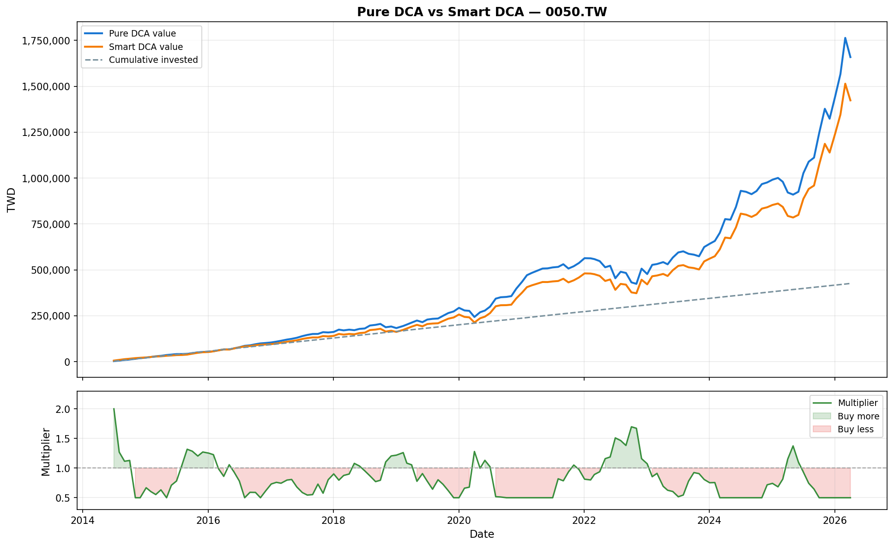

# Taiwan ETF Backtester — Pure DCA vs Smart DCA

Backtest two dollar-cost averaging strategies on any Taiwan ETF (default: **0050.TW**) over a custom date range.

## Results — 0050.TW (Jul 2014 → Apr 2026, 3,000 TWD/month)

| Metric | Pure DCA | Smart DCA |
|---|---|---|
| Total invested | 426,000 | 348,595 |
| Final value | 1,658,784 | 1,423,172 |
| Profit | 1,232,784 | 1,074,577 |
| Total return | 289.39% | 308.26% |
| Annualised return | 12.26% | **12.72%** |
| Max drawdown | -24.80% | **-22.45%** |

Smart DCA invested **18% less capital** while delivering **+0.45% higher annualised return** and a shallower drawdown.
⚠️ That +0.45% figure is misleading — the two strategies didn't invest the same total amount. See [Discussion: Why "+0.45% Edge" Is Misleading](#discussion-why-045-edge-is-misleading).



## Strategy Logic

### Pure DCA
Invest exactly `--monthly` TWD on the first trading day of every month. No market timing.

### Smart DCA
Adjust the monthly investment amount by a multiplier in [0.5×, 2.0×] based on two signals computed from **t-1 closing data** (no look-ahead):

| Signal | Logic |
|---|---|
| **MA200 distance** | Price below 200-day MA → buy more; price above → buy less |
| **6-month momentum** | Negative trailing return → buy more; positive → buy less |

Both signals are normalised to [−1, +1] and averaged. Multiplier = `clip(1 + combined, 0.5, 2.0)`.

Months near a bottom (below MA200 and falling) get up to 2× the normal amount; months near a peak get as little as 0.5×.

## Transaction Costs

Taiwan market costs are applied on every trade:

| Cost | Rate |
|---|---|
| Brokerage fee (buy) | 0.1425% |
| Brokerage fee (sell) | 0.1425% |
| Securities transaction tax (sell only) | 0.30% |

The backtest models buy costs on every monthly purchase. Sell costs are defined but no selling occurs in a pure accumulation strategy.

## Usage

```bash
pip install -r requirements.txt

# Default: 0050.TW, Jul 2014 → Apr 2026, 3,000 TWD/month
python backtest.py

# Custom
python backtest.py --ticker 006208.TW --start 2019-01 --end 2026-04 --monthly 5000 --output results/
```

### Arguments

| Argument | Default | Description |
|---|---|---|
| `--ticker` | `0050.TW` | Yahoo Finance ticker |
| `--start` | `2014-07` | Start month (`YYYY-MM`) |
| `--end` | `2026-04` | End month (`YYYY-MM`) |
| `--monthly` | `3000` | Monthly budget (TWD) |
| `--output` | `output/` | Folder for CSV and PNG output |

### Output files

| File | Content |
|---|---|
| `output/pure_dca.csv` | Month-by-month Pure DCA ledger |
| `output/smart_dca.csv` | Month-by-month Smart DCA ledger with multipliers |
| `output/backtest.png` | Dual-panel chart (portfolio value + multiplier history) |

## Discussion: Why "+0.45% Edge" Is Misleading

A reader might conclude Smart DCA "wins" thanks to a higher annualised return.
But this comparison has a subtle flaw worth understanding.

**Smart DCA invested 18% less capital, not the same capital differently.**

The CAGR formula `(final/invested)^(1/years) - 1` implicitly treats invested
capital as a single lump sum. When two strategies invest different total
amounts, comparing their CAGRs is misleading.

A fair comparison: assume the 77,405 TWD that Smart DCA *didn't* invest sat
in a money market fund earning ~1.5% annually. Over 14 years, that becomes
roughly 95,000 TWD.

| Strategy | Final value (in market) | True final value (incl. uninvested cash) |
|---|---|---|
| Pure DCA | 1,658,784 | 1,658,784 |
| Smart DCA | 1,423,172 | 1,423,172 + ~95,000 = ~1,518,172 |

**On a like-for-like basis, Pure DCA outperforms Smart DCA by ~140,000 TWD.**

The right metric for DCA is XIRR (money-weighted return), not CAGR.
This will be added in a future version.

### What I learned

I started this expecting Smart DCA to win because the multiplier "buys low,
buys less when expensive." The backtest told me otherwise — but only after
I noticed the CAGR was comparing apples to oranges. The lesson:

> A backtest is only as honest as the metric you choose to look at.

## Caveats

- **CAGR approximation**: uses `(final/invested)^(1/years) - 1`, not XIRR. True money-weighted return (XIRR) would be slightly lower because early capital compounds the longest.
- **Fractional shares**: the model allows fractional shares. Real brokers round to whole shares or board lots (1,000 shares on TWSE).
- **Dividend handling**: `yfinance auto_adjust=True` provides dividend-adjusted prices. Reinvestment is implicit in the price series rather than modelled as separate purchases.
- **Warm-up period**: 300 trading days of extra history are fetched before `--start` so that MA200 and 6-month momentum are valid on the first purchase date.

## Requirements

- Python 3.8+
- yfinance, pandas, numpy, matplotlib
